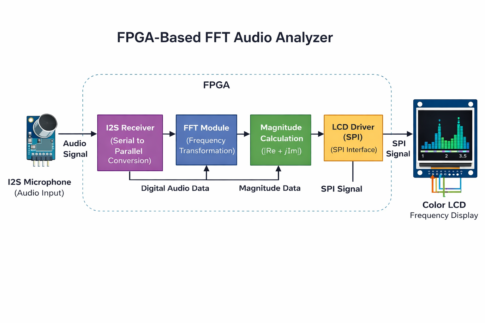
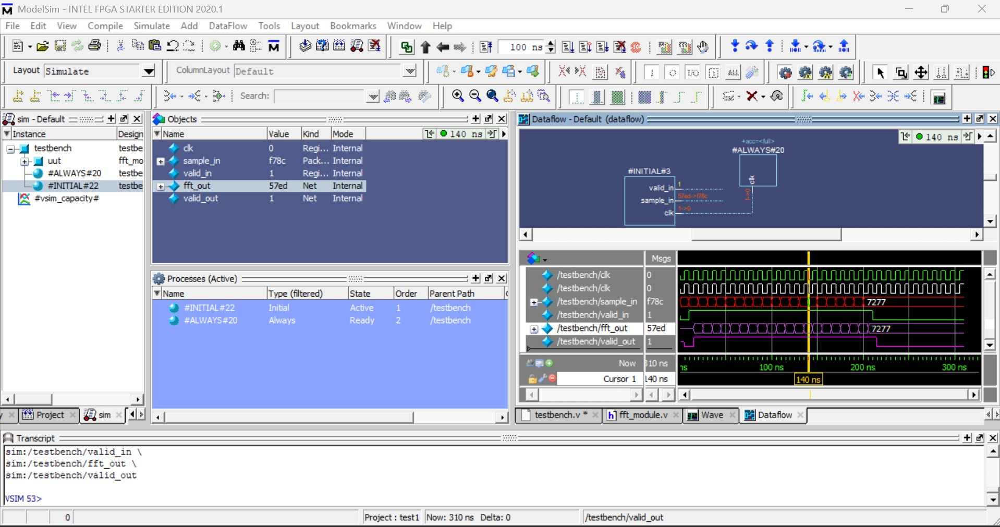

# FPGA-Based Real-Time FFT Audio Signal Analyzer

## 📌 Overview
This project implements a real-time audio signal analyzer using FPGA. The system captures audio input via an I2S microphone, processes it using Fast Fourier Transform (FFT), and displays frequency spectrum data on an SPI-based LCD.

---

## 🧱 System Architecture

---

## 🔄 System Flow
I2S Microphone → I2S Receiver → FFT Module → Magnitude Calculation → LCD Driver → Display Output

---

## ⚙️ Features
- Real-time audio acquisition (I2S interface)
- Hardware-based FFT processing
- Magnitude calculation of frequency bins
- LCD visualization (SPI interface - ST7735)
- Modular Verilog design

---

## 📁 Project Structure

src/ → Verilog source files
tb/ → Testbench files
constraints/ → FPGA pin constraints
Docs/ → Diagrams and images
Results/ → Simulation outputs

---

## 📊 Simulation Result

---

## ▶️ How to Run
1. Open project in Xilinx ISE 14.7  
2. Add all Verilog files from `src/`  
3. Add constraints file from `constraints/`  
4. Run simulation using testbench from `tb/`  
5. Generate bitstream  
6. Program FPGA board  

---

## 🛠 Hardware Used
- Spartan-6 FPGA (LX9 MicroBoard)
- I2S Microphone
- ST7735 SPI LCD Display

---

## 👨‍💻 Author
**Amin Uddin Qureshi**  
- 18+ years experience in PCB repair & diagnostics  
- FPGA & Embedded Systems Developer  
- Expertise in hardware debugging, JTAG, and test equipment  

---

## 🚀 Future Work
- Integration with Power BI for visualization  
- Advanced filtering techniques  
- Real-time audio classification using AI  

---